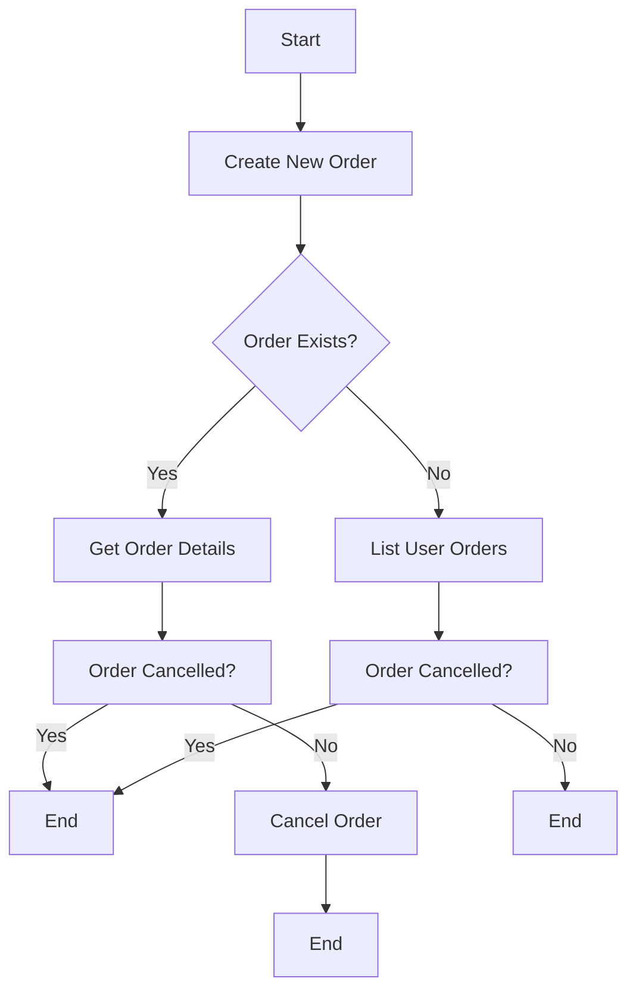

```
# Order API Endpoints Documentation

This document outlines the REST API endpoints for order management in the e-commerce application.

## Endpoints

### 1. Create a New Order

**Endpoint:** `/api/orders/create`

**Method:** `POST`

**Description:** This endpoint allows users to create a new order by providing order items, shipping address, and payment method.

**Request Body:**

```json
{
  "items": [
    {
      "product_id": "string",
      "quantity": number,
      "price": number
    }
  ],
  "shipping_address": "string",
  "payment_method": "string"
}
```

**Response:**

```json
{
  "order_id": "string",
  "status": "string",
  "total": number,
  "items": [
    {
      "product_id": "string",
      "quantity": number,
      "price": number
    }
  ],
  "created_at": "string"
}
```

**Error Handling:**

- `HTTPException` with status code `400` if validation fails.
- `HTTPException` with status code `500` if payment processing fails.

### 2. Get Order Details

**Endpoint:** `/api/orders/{order_id}`

**Method:** `GET`

**Description:** This endpoint retrieves the details of a specific order by its ID. Users can only access their own orders.

**Path Parameters:**

- `order_id` (string): The unique identifier of the order.

**Response:**

```json
{
  "order_id": "string",
  "status": "string",
  "total": number,
  "items": [
    {
      "product_id": "string",
      "quantity": number,
      "price": number
    }
  ],
  "created_at": "string"
}
```

**Error Handling:**

- `HTTPException` with status code `404` if the order is not found.
- `HTTPException` with status code `403` if the user is not authorized to access the order.

### 3. List User Orders

**Endpoint:** `/api/orders/`

**Method:** `GET`

**Description:** This endpoint lists all orders for the current user, supporting pagination via `limit` and `offset` parameters.

**Query Parameters:**

- `limit` (integer, default: 10): The number of orders to return per page.
- `offset` (integer, default: 0): The number of orders to skip before starting to collect the result set.

**Response:**

```json
[
  {
    "order_id": "string",
    "status": "string",
    "total": number,
    "items": [
      {
        "product_id": "string",
        "quantity": number,
        "price": number
      }
    ],
    "created_at": "string"
  }
]
```

**Error Handling:**

- `HTTPException` with status code `400` if invalid parameters are provided.

### 4. Cancel an Order

**Endpoint:** `/api/orders/{order_id}/cancel`

**Method:** `POST`

**Description:** This endpoint allows users to cancel a pending order. Orders that are processing or shipped cannot be cancelled.

**Path Parameters:**

- `order_id` (string): The unique identifier of the order.

**Response:**

```json
{
  "message": "Order cancelled successfully"
}
```

**Error Handling:**

- `HTTPException` with status code `404` if the order is not found.
- `HTTPException` with status code `403` if the user is not authorized to cancel the order.
- `HTTPException` with status code `400` if the order status is not 'pending'.
```

## Flowchart



## Dependencies

- `src.auth.verify_token`: Verifies the JWT token for authentication.
- `src.database.orders.OrderRepository`: Manages order data in the database.
- `src.utils.notifications.send_order_confirmation`: Sends an email confirmation for the order.
- `src.payments.processor.PaymentProcessor`: Handles payment processing operations.
```

## Payment Processing

The payment processing is handled by the `PaymentProcessor` class in the `payments/processor.py` module. It supports multiple payment providers and transaction management.

```python
class PaymentProcessor:
    def __init__(self, provider: PaymentProvider = PaymentProvider.STRIPE):
        self.provider = provider

    # Payment processing methods go here
```

## Error Handling

The API endpoints handle various errors and return appropriate HTTP status codes and error messages.

- `HTTPException` with status code `400` for bad requests.
- `HTTPException` with status code `401` for unauthorized access.
- `HTTPException` with status code `403` for forbidden access.
- `HTTPException` with status code `404` for not found resources.
- `HTTPException` with status code `500` for internal server errors.

## Security

All endpoints require authentication via JWT token. The `get_current_user` function verifies the token and retrieves the current user's information.

```python
def get_current_user(token: str = Depends(oauth2_scheme)):
    payload = verify_token(token)
    if not payload:
        raise HTTPException(
            status_code=status.HTTP_401_UNAUTHORIZED,
            detail="Invalid or expired token"
        )
    return {'id': payload['user_id']}
```

## Conclusion

This documentation provides a comprehensive overview of the order management API endpoints in the e-commerce application. It covers the endpoints, request/response formats, error handling, dependencies, payment processing, and security aspects.

```